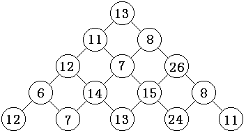

# 数字三角形问题

**问题描述**

给出一个n层的三角形，每个位置有一个数字，到达后可获得，求到达最低层能达到的最大数字和。

**问题分析**



方法 1：递归计算，存在重复计算
```C++
int solve(int i,int j){
    return a[i][j] + (i == n? 0:max(solve(i+1,j),solve(i+1,j+1)));
}
```

方法 2:  递推计算
时间复杂度 O(n^2),i 是 逆序枚举

```C++
int i,j;
for(j = 1;j<=n;j++)d[n][j] = a[n][j];
for(i = n-1;i>=1;i--){
    for( j = 1;j<=1;j++){
        d[i][j] = a[i][j] + max(d[i+1][j],d[i+1][j+1]);
    }
}
```

方法 3：记忆化搜索
```C++
memset(d,-1,sizeof(d));//把d 全部初始化为-1，然后编写递归函数

int solve(int i,int j){
    if(d[i][j] >=0) return d[i][j];
    return d[i][j] = a[i][j] + (i == n?0:max(solve(i+1,j),solve(i+1,j+1)));
}
```